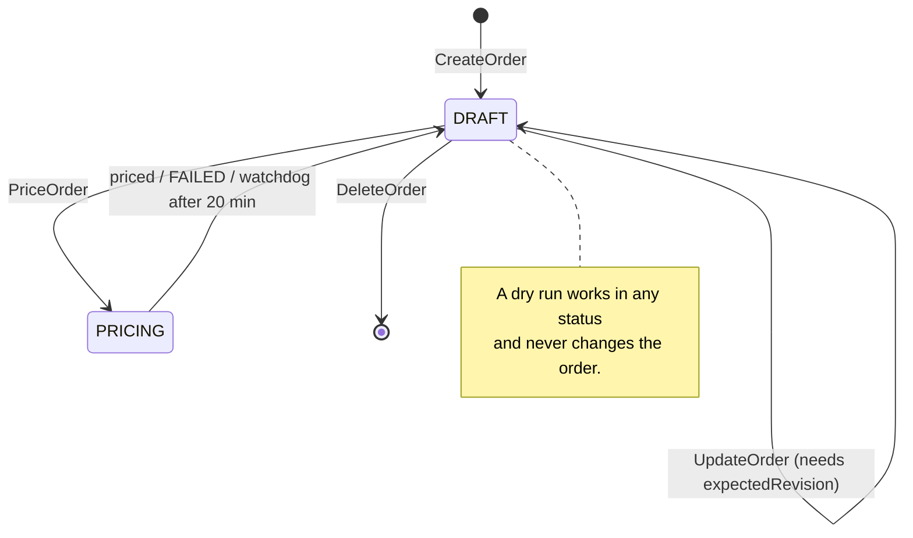
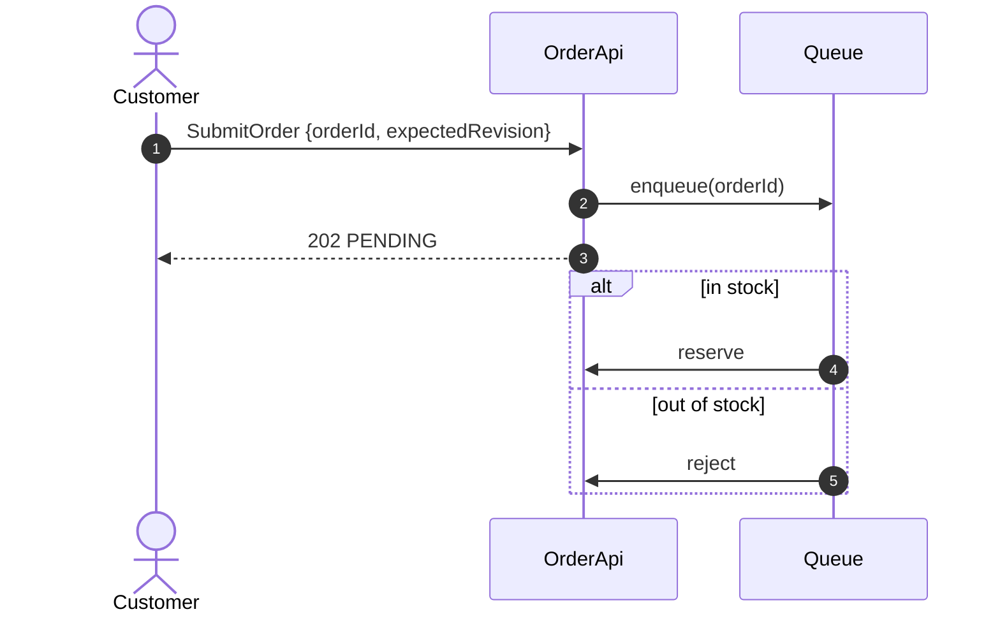
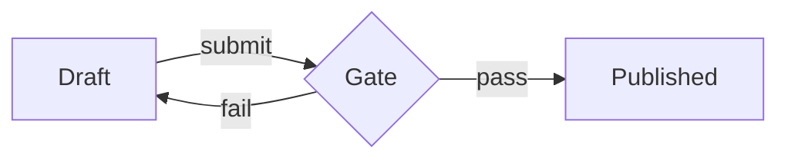

# Order lifecycle

An order moves through these states.

```mermaid
stateDiagram-v2
    [*] --> DRAFT: CreateOrder
    DRAFT --> DRAFT: UpdateOrder (needs expectedRevision)
    DRAFT --> PRICING: PriceOrder
    PRICING --> DRAFT: priced / FAILED / watchdog after 20 min
    DRAFT --> [*]: DeleteOrder
    note right of DRAFT
      A dry run works in any status
      and never changes the order.
    end note
```

How a submit reaches the warehouse:

```mermaid
sequenceDiagram
    autonumber
    actor C as Customer
    participant API as OrderApi
    participant Q as Queue
    C->>API: SubmitOrder {orderId, expectedRevision}
    API->>Q: enqueue(orderId)
    API-->>C: 202 PENDING
    alt in stock
        Q->>API: reserve
    else out of stock
        Q->>API: reject
    end
```

```mermaid
flowchart LR
    A[Draft] -->|submit| B{Gate}
    B -->|pass| C[Published]
    B -->|fail| A
```

One that does not parse:

```mermaid
flowchart LR
    A -->> -->
```
